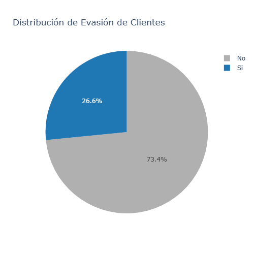
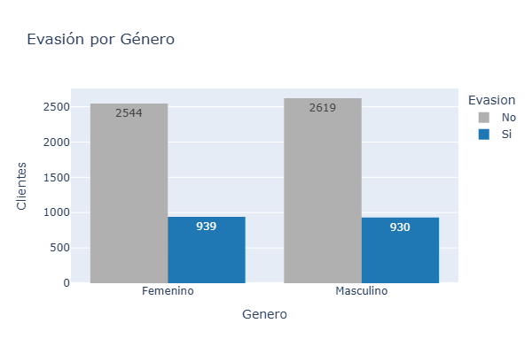
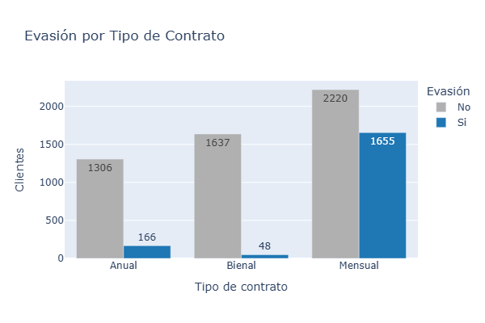
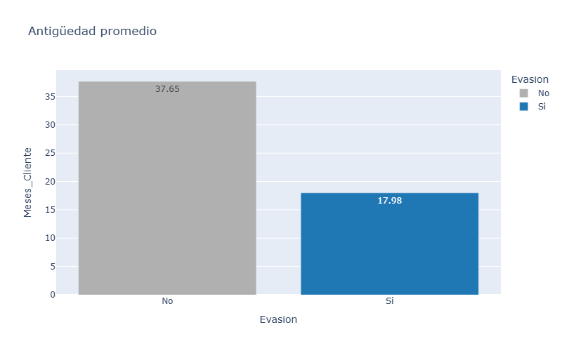
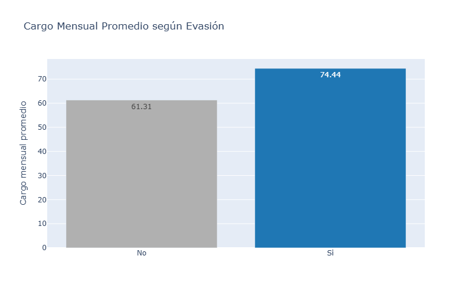
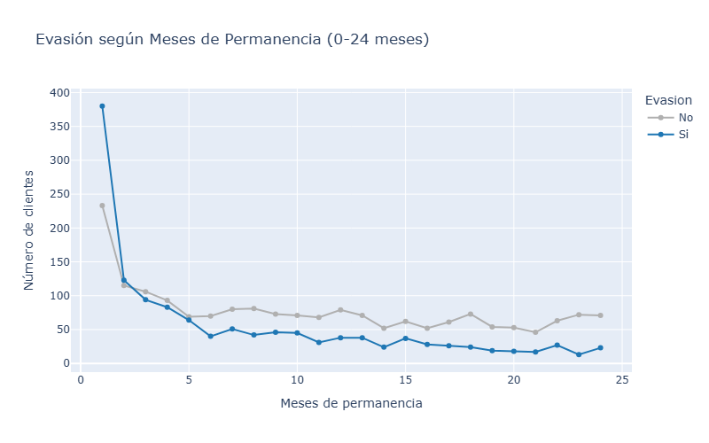
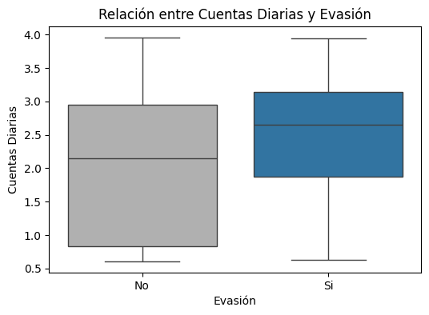
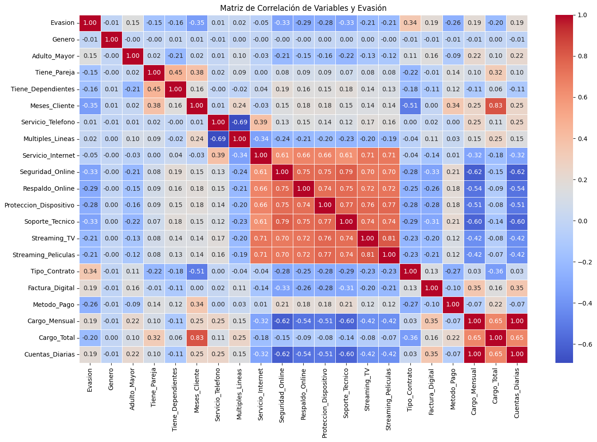

# 📊 ANÁLISIS DE EVASIÓN DE CLIENTES

## 📌 Descripción del proyecto
Este proyecto tiene como objetivo analizar la **evasión de clientes** a partir de un conjunto de datos de Telecom X.
Mediante análisis exploratorio y visualización de datos, se identifican patrones clave que explican por qué los clientes abandonan el servicio, con el fin de apoyar la toma de decisiones estratégicas.

El enfoque es **práctico, claro y académico**, siguiendo buenas prácticas de análisis de datos y visualización.

## 📑 Tabla de contenido
1. Descripción del proyecto  
2. Objetivo  
3. Tecnologías utilizadas  
4. Desarrollo del proyecto  
5. Resultados e insights clave  
6. Conclusión y Recomendaciones
7. Autor

## 🎯 Objetivo
- Analizar el comportamiento de evasión de clientes.
- Identificar variables y compararlas con la evasión.
- Visualizar patrones mediante gráficos claros y comprensibles.
- Generar recomendaciones de valor para la toma de decisiones.

## 🛠️ Tecnologías utilizadas

## 🧩 Desarrollo del proyecto
El proyecto se desarrolló siguiendo una estructura lógica y ordenada:

1. **Carga y revisión de datos**
   - Revisión de columnas, tipos de datos y valores faltantes.
   - Identificación de variables.

2. **Manejo de incoherencias**
   - Solución de inconsistencias
   - Creación de columnas
   - Estandarización de datos

3. **Análisis de datos**

   -Se genera la información para generar gráficas, distribución de evasión.
   

     
   
     
   - Comparación de Evasión con: Género, Tipo de Contrato y Método de pago como variables categóricas.
   

    
    
    
    

   - Comparación de Evasión con: Antiguedad promedio, Cargo Mensual y Según permanencia (en 2 años)
        

    
    
    
      

   - Comparación con cuentas diarias y análisis de matriz de correlación.
     

    
    
    

## 📈 Resultados e insights clave
- Los contratos **mensuales** presentan mayor evasión comparados con contratos anuales o bienales.
- La **antigüedad promedio** de los clientes que evaden es menor.
- El **cargo mensual promedio** es más alto en clientes que abandonan el servicio.
- El **método de pago** influye en la evasión.
- Algunas variables muestran correlación directa con la evasión, lo que permite priorizar acciones preventivas.

## ✅ Conclusión y Recomendaciones
El análisis muestra que la evasión se concentra en los primeros meses, especialmente en clientes con contratos mensuales y cargos elevados, mientras que los pagos automáticos y mayor antigüedad favorecen la permanencia.
Factores como el género no influyen de forma relevante, por lo que la retención debe enfocarse en el comportamiento del cliente, el valor percibido y el monitoreo temprano de patrones de riesgo.

  -Optimizar la fidelización temprana: Crear programas de bienvenida, seguimiento personalizado y beneficios en los primeros 3–6 meses para reducir la evasión inicial.
  -Segmentar según tipo de contrato y cargo mensual: Incentivar contratos de mayor duración y ofrecer planes ajustados a la capacidad de pago del cliente para minimizar cancelaciones por percepción de alto costo.
  -Promover métodos de pago automáticos: Facilitar la suscripción recurrente mediante débitos automáticos y recordatorios digitales para aumentar la retención.

## 👩‍💻 Autor
**Proyecto realizado por: Ing. Fernanda Torres** 

GitHub: https://github.com/Maffert

